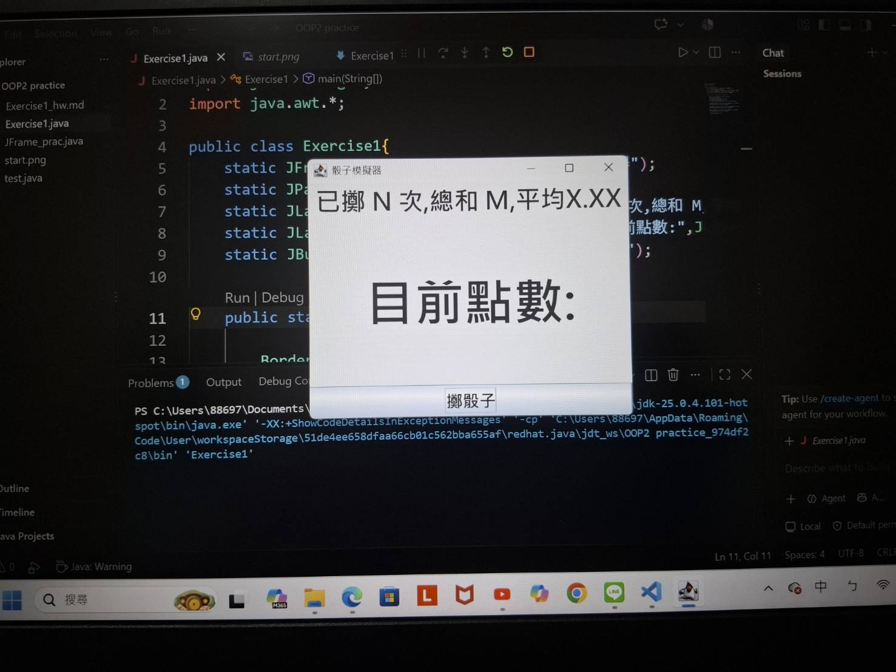
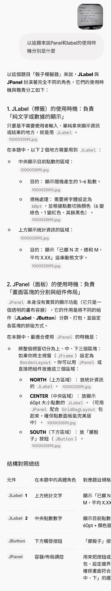
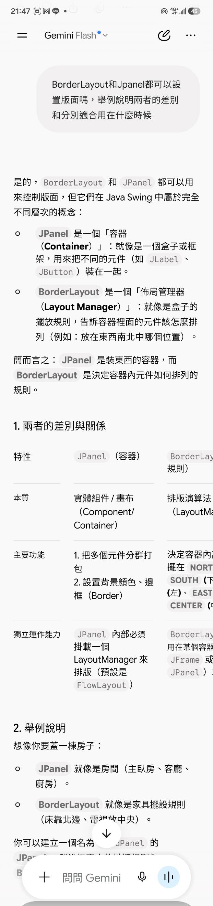
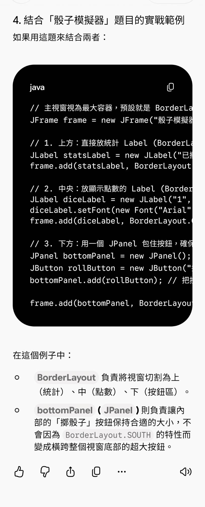
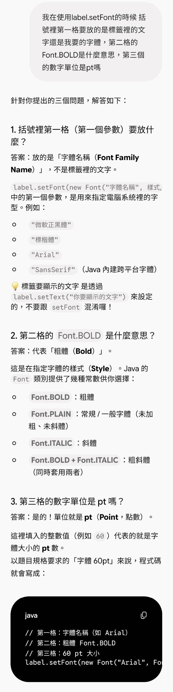

#Java作業:骰子模擬器
學號:A1143312/姓名:鄭楚瀠

##程式畫面截圖

##與AI對話紀錄  

##AI給我的答案和我自己寫的差異

不同的地方有兩個，第一個是我的視窗和標籤、按鈕都是用靜態變數，在計算上可以累加數據，更方便;第二個是AI在教我使用BorderLayout時沒有先新增一個BorderLayout的物件，也沒有在frm設置排版方式，就直接在frm.add後使用了BorderLayout